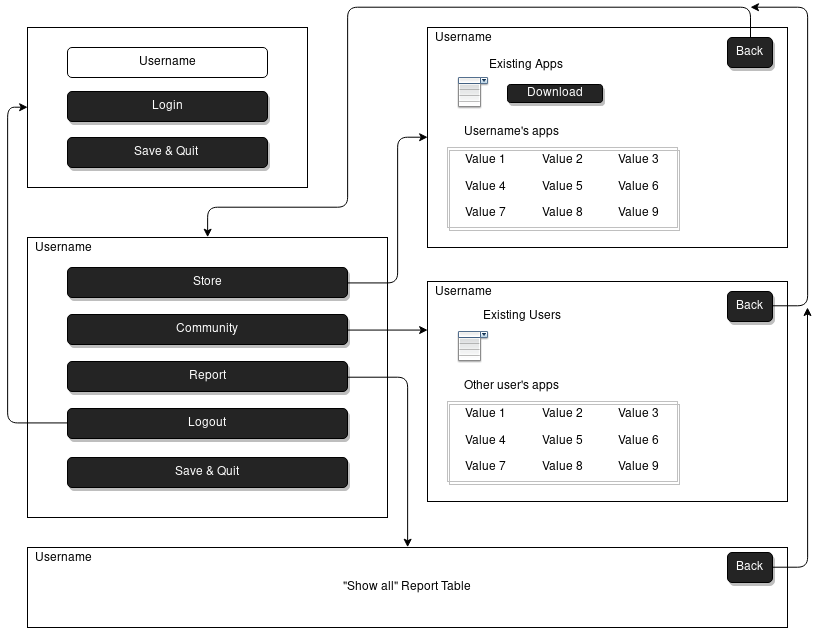

# App Store

## TODO:

* Merge sort in Community, User, Store, and App classes.
* ~~Generics in database class~~ Never mind
* Advanced search in Community, User, Store, and App classes.
* Update tex documentation.
* Update javadoc.
* Transcribe tex documentation to README.
* Update menu in Driver class.
* ~~Add compareTo and equals methods in User and App classes.~~ Completed
* Continue developing front-end.
* Add license post merge, or learn how to resolve merge conflicts.

## Introduction
This program will implement a database of Users, Apps, and Reviews to make up a social app store.
It tracks a user’s owned apps, existing apps, and reviews of that app.
This creates a useful store and essentially it’s own digital marketplace where anyone can create their own applications.
My list of apps will be contained within a store object, while my users are contained within my community object.

## Application Architecture
The application contains several components which are depicted in Figure~\ref{UML}.
I will use three plain java objects for my program.
My first object App will contain the name of the app, the creator (username), the appId, and the date of creation.
The second object User will contain the username, userId, ownedApps, and usersReviews.
The third object Review will store a rating --- an integer of one through ten --- and some review related text.

